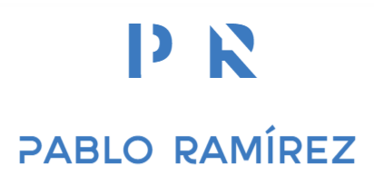

# Hola a todos!! 👋
## hola que tal?
### Soy Pablo Ramírez y estás en mi perfil publico de GitHub!! Gracias por pasarte, en unas lineas te cuento un poco sobre mí!
---------------------------------------------------

La programación nunca fue mi fuerte pero... por quué no darle otra oportunidad?

Intentaré ir subiendo mis cosillas personales además de mis aportaciones a otros proyectos

Tengo una web desde la que me gustaría informaros de todos mis pasos con la tecnología
mi web: [Pablo Ramírez](https://pabloramirez.es/).

<!--
**borazuwarah/borazuwarah** is a ✨ _special_ ✨ repository because its `README.md` (this file) appears on your GitHub profile.

Here are some ideas to get you started:

- 🔭 I’m currently working on ...
- 🌱 I’m currently learning ...
- 👯 I’m looking to collaborate on ...
- 🤔 I’m looking for help with ...
- 💬 Ask me about ...
- 📫 How to reach me: ...
- 😄 Pronouns: ...
- ⚡ Fun fact: ...

https://docs.github.com/en/get-started/writing-on-github/getting-started-with-writing-and-formatting-on-github/basic-writing-and-formatting-syntax

-->
